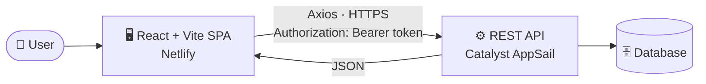

<div align="center">

# 💸 Expense Tracker

**A full-stack personal finance app to track income and expenses, and see where your money goes.**

[](https://react.dev)
[](https://vite.dev)
[](https://tailwindcss.com)
[](https://recharts.org)
[](https://nodejs.org)
[](https://www.netlify.com)

[🚀 Live Demo](#-live-demo) · [✨ Features](#-features) · [🏗️ Architecture](#%EF%B8%8F-architecture) · [⚡ Quick Start](#-quick-start) · [🔌 API](#-api-reference) · [🤝 Contributing](#-contributing)

</div>

---

## 📖 Table of Contents

<details>
<summary><b>Click to expand</b></summary>

- [Live Demo](#-live-demo)
- [Features](#-features)
- [Tech Stack](#-tech-stack)
- [Architecture](#%EF%B8%8F-architecture)
- [Project Structure](#-project-structure)
- [Quick Start](#-quick-start)
- [Environment Variables](#-environment-variables)
- [Connecting Frontend to Backend](#-connecting-frontend-to-backend)
- [API Reference](#-api-reference)
- [Deployment](#-deployment)
- [Troubleshooting](#-troubleshooting)
- [Scripts](#-scripts)
- [Roadmap](#-roadmap)
- [Contributing](#-contributing)
- [Author](#-author)

</details>

---

## 🚀 Live Demo

| Part                              | Link                                |
| --------------------------------- | ----------------------------------- |
| 🌐 Frontend (Netlify)             | `https://your-app.netlify.app`      |
| ⚙️ Backend API (Catalyst AppSail) | `https://your-appsail-domain`       |
| 📂 Backend source                 | `<add your backend repo link here>` |

> 🔑 **Demo login:** `demo@example.com` / `demo1234` _(replace with your own test account, or delete this line)_

---

## ✨ Features

- 🔐 **Authentication**: sign up and log in; requests are sent with an `Authorization` header
- 📊 **Dashboard**: overview of balance, income and expenses
- 📈 **Charts**: visual breakdown of spending with Recharts
- ➕ **Add, view and delete transactions** for both income and expenses
- 😀 **Emoji icons**: pick an emoji for each income or expense source
- 📅 **Date handling** with Moment.js
- 🔔 **Toast notifications** for instant feedback (react-hot-toast)
- 📱 **Responsive UI** built with Tailwind CSS
- 🔄 **SPA routing** with React Router (deep links like `/dashboard` work after refresh)

<details>
<summary>📸 <b>Screenshots</b> (click to expand)</summary>

<br>

| Login                      | Dashboard                          |
| -------------------------- | ---------------------------------- |
|  |  |

| Income                       | Expenses                        |
| ---------------------------- | ------------------------------- |
|  |  |

> Create a `docs/` folder, add your screenshots, and these will render automatically.

</details>

---

## 🧰 Tech Stack

<table>
  <tr>
    <th>Layer</th>
    <th>Technology</th>
  </tr>
  <tr>
    <td><b>Frontend</b></td>
    <td>React 19, Vite, React Router 7, Tailwind CSS 4, Axios, Recharts, react-hot-toast, react-icons, emoji-picker-react, Moment.js</td>
  </tr>
  <tr>
    <td><b>Backend</b></td>
    <td>REST API hosted on Zoho Catalyst (AppSail) &nbsp;<i>(edit to match your backend: Node/Express, database, etc.)</i></td>
  </tr>
  <tr>
    <td><b>Tooling</b></td>
    <td>ESLint 10, Vite dev proxy</td>
  </tr>
  <tr>
    <td><b>Hosting</b></td>
    <td>Netlify (frontend), Catalyst AppSail (backend)</td>
  </tr>
</table>

---

## 🏗️ Architecture



**How the two sides talk to each other**

| Mode               | How requests reach the API                                                                                                             |
| ------------------ | -------------------------------------------------------------------------------------------------------------------------------------- |
| 🧑‍💻 **Development** | The browser calls `/api/...` on the Vite dev server, which **proxies** it to the backend (see `vite.config.js`). No CORS setup needed. |
| 🚀 **Production**  | The browser calls the API **directly** at `VITE_API_BASE_URL`. The backend must allow the frontend origin via CORS.                    |

---

## 📁 Project Structure

```text
Expense-Tracker/
├── public/              # Static assets
├── src/                 # React source code (components, pages, API helpers)
├── .env.example         # Template for environment variables
├── eslint.config.js     # Lint rules
├── index.html           # App entry HTML
├── netlify.toml         # Netlify build + SPA redirect config
├── package.json         # Dependencies and scripts
└── vite.config.js       # Vite config + /api dev proxy
```

---

## ⚡ Quick Start

### Prerequisites

- **Node.js** `20.19+` or `22.12+`
- **npm**
- The **backend API** running locally or deployed

### 1️⃣ Clone the repo

```bash
git clone https://github.com/AKASH142005/Expense-Tracker.git
cd Expense-Tracker
```

### 2️⃣ Install dependencies

```bash
npm ci
```

### 3️⃣ Set up environment variables

<details open>
<summary><b>🍎 macOS / 🐧 Linux</b></summary>

```bash
cp .env.example .env
```

</details>

<details>
<summary><b>🪟 Windows (PowerShell)</b></summary>

```powershell
Copy-Item .env.example .env
```

</details>

Then open `.env` and fill in the values (see [Environment Variables](#-environment-variables)).

### 4️⃣ Start the dev server

```bash
npm run dev
```

Open **http://localhost:5173** 🎉

> 💡 In development, Vite proxies `/api` requests to the backend configured in `vite.config.js`. Make sure the proxy `target` points to your running backend.

---

## 🔐 Environment Variables

| Variable            |    Required     | Description                                                                                                             | Example                       |
| ------------------- | :-------------: | ----------------------------------------------------------------------------------------------------------------------- | ----------------------------- |
| `VITE_API_BASE_URL` | Production only | **Origin only** of the deployed API. No trailing slash and **no `/api` suffix** (the API paths already include `/api`). | `https://your-appsail-domain` |

> ⚠️ **Never put secrets in `VITE_*` variables.** They are embedded in the browser bundle and visible to anyone.
>
> If `VITE_API_BASE_URL` is **unset**, the app uses the Vite proxy (dev server and `vite preview`).

---

## 🔗 Connecting Frontend to Backend

<details open>
<summary><b>Step-by-step checklist</b></summary>

1. **Deploy or run the backend** and note its origin, for example `https://your-appsail-domain`.
2. **Local development:** set the proxy `target` in `vite.config.js` to that origin.
3. **Production build:** set `VITE_API_BASE_URL` to that origin.
4. **Enable CORS on the backend** for your frontend origin (for example `https://your-app.netlify.app` and `http://localhost:5173`).
5. **Allow these headers** in the backend CORS config: `Authorization` and `Content-Type`.
6. **Restart** the dev server after changing any env value.

</details>

<details>
<summary><b>Example Axios setup</b></summary>

```js
import axios from "axios";

const axiosInstance = axios.create({
  baseURL: import.meta.env.VITE_API_BASE_URL || "", // empty = use Vite proxy
  timeout: 10000,
  headers: { "Content-Type": "application/json" },
});

axiosInstance.interceptors.request.use((config) => {
  const token = localStorage.getItem("token");
  if (token) config.headers.Authorization = `Bearer ${token}`;
  return config;
});

export default axiosInstance;
```

</details>

<details>
<summary><b>Example backend CORS config (Node/Express)</b></summary>

```js
import cors from "cors";

app.use(
  cors({
    origin: ["http://localhost:5173", "https://your-app.netlify.app"],
    allowedHeaders: ["Authorization", "Content-Type"],
    methods: ["GET", "POST", "PUT", "DELETE"],
  }),
);
```

</details>

---

## 🔌 API Reference

> ✏️ **Edit these to match your real backend routes.** This is a suggested layout for an expense tracker.

<details>
<summary><b>🔑 Auth</b></summary>

| Method | Endpoint             | Description                |
| ------ | -------------------- | -------------------------- |
| `POST` | `/api/auth/register` | Create a new account       |
| `POST` | `/api/auth/login`    | Log in and receive a token |
| `GET`  | `/api/auth/me`       | Get the current user       |

</details>

<details>
<summary><b>💰 Income</b></summary>

| Method   | Endpoint          | Description            |
| -------- | ----------------- | ---------------------- |
| `GET`    | `/api/income`     | List all income        |
| `POST`   | `/api/income`     | Add income             |
| `DELETE` | `/api/income/:id` | Delete an income entry |

</details>

<details>
<summary><b>🧾 Expenses</b></summary>

| Method   | Endpoint           | Description       |
| -------- | ------------------ | ----------------- |
| `GET`    | `/api/expense`     | List all expenses |
| `POST`   | `/api/expense`     | Add an expense    |
| `DELETE` | `/api/expense/:id` | Delete an expense |

</details>

<details>
<summary><b>📊 Dashboard</b></summary>

| Method | Endpoint         | Description                                |
| ------ | ---------------- | ------------------------------------------ |
| `GET`  | `/api/dashboard` | Totals, recent transactions and chart data |

</details>

<details>
<summary><b>Example request / response</b></summary>

```http
POST /api/expense
Authorization: Bearer <token>
Content-Type: application/json

{
  "icon": "🍔",
  "category": "Food",
  "amount": 250,
  "date": "2026-09-30"
}
```

```json
{
  "id": "abc123",
  "icon": "🍔",
  "category": "Food",
  "amount": 250,
  "date": "2026-09-30"
}
```

</details>

---

## ☁️ Deployment

### Frontend → Netlify

The repo includes a `netlify.toml`. In your Netlify site settings:

| Setting              | Value                                           |
| -------------------- | ----------------------------------------------- |
| Build command        | `npm ci && npm run build`                       |
| Publish directory    | `dist`                                          |
| Environment variable | `VITE_API_BASE_URL=https://your-appsail-domain` |

The build output goes to `dist/`. The host must serve `index.html` for unknown routes so paths like `/dashboard` still work after a refresh.

<details>
<summary><b>Manual production build</b></summary>

**macOS / Linux**

```bash
VITE_API_BASE_URL=https://your-appsail-domain npm run build
```

**Windows PowerShell**

```powershell
$env:VITE_API_BASE_URL = "https://your-appsail-domain"
npm run build
```

Preview locally:

```bash
npm run preview
```

</details>

### Backend → Catalyst AppSail

Deploy your API to AppSail, copy its public URL, and use it as `VITE_API_BASE_URL`. Remember to add your Netlify URL to the backend CORS allowlist.

---

## 🛠️ Troubleshooting

<details>
<summary>❌ <b>CORS error in the browser console</b></summary>

Add your frontend origin (Netlify URL and `http://localhost:5173`) to the backend CORS allowlist, and allow the `Authorization` and `Content-Type` headers.

</details>

<details>
<summary>❌ <b>Requests go to <code>/api/api/...</code> (404)</b></summary>

`VITE_API_BASE_URL` must be an origin only. Remove any trailing `/api` or `/`.

</details>

<details>
<summary>❌ <b>Page refresh gives 404 on <code>/dashboard</code></b></summary>

Make sure your host serves `index.html` for unknown routes. On Netlify, check the redirect rule in `netlify.toml`.

</details>

<details>
<summary>❌ <b>API calls fail in local dev</b></summary>

Check that the backend is running and that the proxy `target` in `vite.config.js` points to it. Restart `npm run dev` after editing the config.

</details>

<details>
<summary>❌ <b>Build fails with a Node version error</b></summary>

This project needs Node.js `20.19+` or `22.12+`. Check with `node -v`.

</details>

---

## 📜 Scripts

| Command           | What it does                           |
| ----------------- | -------------------------------------- |
| `npm run dev`     | Start the Vite dev server with HMR     |
| `npm run build`   | Create a production build in `dist/`   |
| `npm run preview` | Preview the production build locally   |
| `npm run lint`    | Run ESLint (run this before deploying) |

---

## 🗺️ Roadmap

- [x] Authentication
- [x] Income and expense tracking
- [x] Dashboard with charts
- [ ] Edit existing transactions
- [ ] Filter and search by date or category
- [ ] Export to CSV / Excel
- [ ] Monthly budgets and alerts
- [ ] Dark mode

---

## 🤝 Contributing

Contributions are welcome!

1. **Fork** the repository
2. **Create** a branch: `git checkout -b feature/amazing-feature`
3. **Commit** your changes: `git commit -m "Add amazing feature"`
4. **Push** the branch: `git push origin feature/amazing-feature`
5. **Open** a Pull Request

Run `npm run lint` before submitting.

---

## 👤 Author

**Akash**

[](https://github.com/AKASH142005)

---

<div align="center">

⭐ **If you found this project useful, please give it a star!** ⭐

</div>
